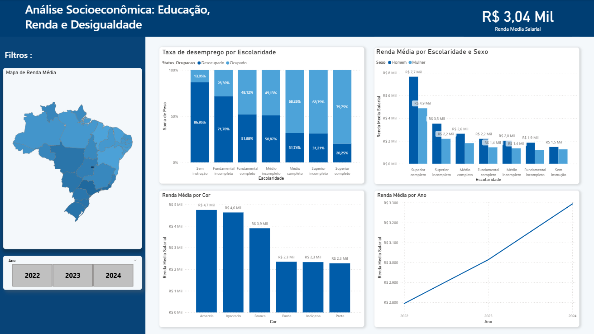

# 📊 Análise Socioeconômica com Dados da PNAD Contínua (IBGE)

## 🎯 Contexto do Projeto

A desigualdade de renda no Brasil é influenciada por diversos fatores estruturais, como escolaridade, gênero e raça.

Este projeto tem como objetivo analisar dados da PNAD Contínua (IBGE) entre 2022 e 2024 para investigar:

- A relação entre escolaridade e desemprego
- O impacto da educação na renda média
- Diferenças salariais por gênero
- Desigualdade racial na renda
- Evolução da renda ao longo do tempo

---

## 🛠️ Metodologia

O projeto foi desenvolvido em duas etapas:

### 1️⃣ Tratamento de Dados
- Extração e organização dos dados da PNAD
- Limpeza de variáveis
- Padronização de categorias
- Criação de métricas de renda média e taxa de desemprego
- Ferramentas: Python (Pandas) no Google Colab

### 2️⃣ Visualização e Análise
- Modelagem dos dados no Power BI
- Criação de dashboard interativo
- Aplicação de design institucional

---

## 📈 Principais Insights Encontrados

- 📉 A taxa de desemprego reduz significativamente conforme aumenta o nível de escolaridade.
- 💰 A renda média cresce proporcionalmente ao grau de instrução.
- ⚖ Homens apresentam renda superior às mulheres em todos os níveis educacionais.
- 🧑🏽‍🤝‍🧑🏿 Persistem diferenças salariais entre grupos raciais.
- 📊 A renda média apresentou crescimento no período analisado (2022–2024).

---

## 🖥️ Dashboard Final

---

## 📂 Estrutura do Repositório

- `notebooks/` → Tratamento e preparação dos dados
- `dados/` → Arquivos processados (quando aplicável)
- `imagens/` → Visualizações do dashboard
- `.pbix` → Arquivo do Power BI

---

## 📚 Fonte de Dados

Instituto Brasileiro de Geografia e Estatística (IBGE)  
PNAD Contínua – Microdados

---

## 🚀 Possíveis Extensões

- Ajuste da renda pela inflação
- Modelagem preditiva da renda
- Análise regional mais aprofundada
- Estudo longitudinal por coorte educacional
